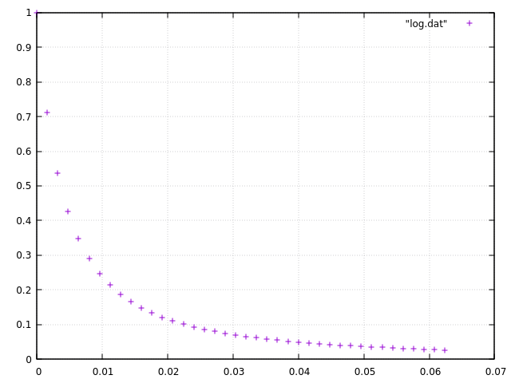

# 3D Heat Equation

$$
u(t,x_{1},x_{2},x_{3}), \ \ \ -1 \le x_{1}, x_{2}, x_{3} \le 1
$$

Heat equation.

$$
\frac{\partial u}{\partial t} = \frac{\partial^2 u}{\partial x_{1}^{2}} + \frac{\partial^2 u}{\partial x_{2}^{2}} + \frac{\partial^2 u}{\partial x_{3}^{2}}
$$

Initial conditions.

$$
u(t=0,x_{1},x_{2},x_{3}) = \exp \left\lbrace - 40 (x_{1}^{2} + x_{2}^{2} + x_{3}^{2})\right\rbrace
$$

Boundary Conditions: Dirichlet 0.

## Results

### value at (0,0,0).

$t$, $u(t,0,0,0)$

```
0.0000000000 1.0000000000
0.0016000000 0.7104677132
0.0032000000 0.5379093547
0.0048000000 0.4254157169
0.0064000000 0.3473110512
0.0080000000 0.2904884086
0.0096000000 0.2476303825
0.0112000000 0.2143639142
0.0128000000 0.1879315497
0.0144000000 0.1665174525
0.0160000000 0.1488822082
0.0176000000 0.1341539606
0.0192000000 0.1217034451
0.0208000000 0.1110663043
0.0224000000 0.1018931819
0.0240000000 0.0939167327
0.0256000000 0.0869292613
0.0272000000 0.0807672255
0.0288000000 0.0753002825
0.0304000000 0.0704234080
0.0320000000 0.0660511344
0.0336000000 0.0621132769
0.0352000000 0.0585517215
0.0368000000 0.0553179811
0.0384000000 0.0523713155
0.0400000000 0.0496772708
0.0416000000 0.0472065330
0.0432000000 0.0449340212
0.0448000000 0.0428381633
0.0464000000 0.0409003146
0.0480000000 0.0391042860
0.0496000000 0.0374359605
0.0512000000 0.0358829775
0.0528000000 0.0344344730
0.0544000000 0.0330808641
0.0560000000 0.0318136688
0.0576000000 0.0306253554
0.0592000000 0.0295092152
0.0608000000 0.0284592557
0.0624000000 0.0274701086
```

### Graph


