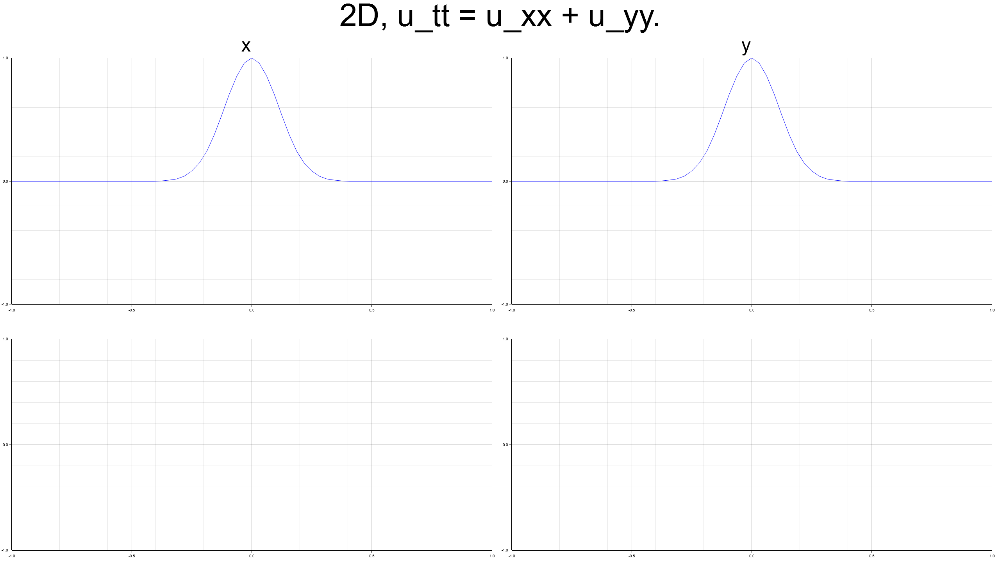

# Difference between odd and even dimensional wave equations

$$
u(t,x_{1},x_{2},x_{3},\dots), \ \ \ -1 < x_{i} < 1
$$

Wave equation.

$$
\frac{\partial^2 u}{\partial t^2} = \sum_{i=1}^{N} \frac{\partial^2 u}{\partial x_{i}^2}
$$

Initial conditions.

$$
u(t=0,x_{1},x_{2},x_{3},\dots) = \frac{\partial u(t=0,x_{1},x_{2},x_{3},\dots)}{\partial t} = \exp \left\lbrace - 40 \sum_{i=0}^{N}x_{i}^2 \right\rbrace
$$

Boundary Conditions: Dirichlet 0.

### visualization 1D, 2D, 3D, 4D wave equation.

comparison.

